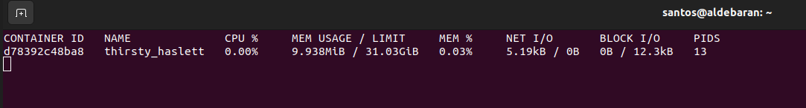
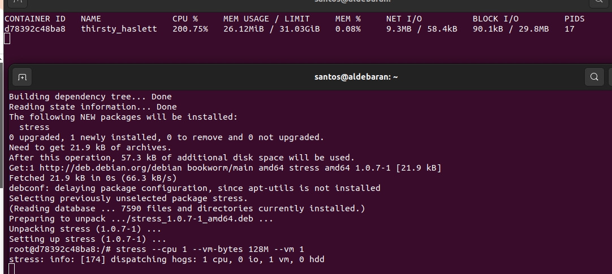
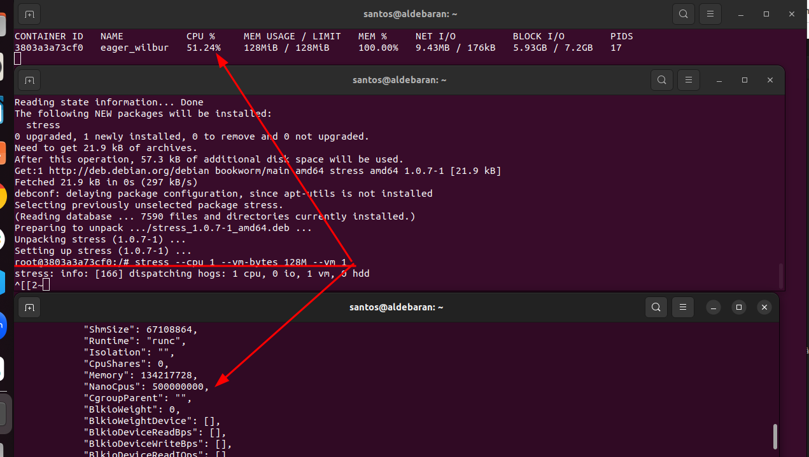

# Comandos básicos do Docker


Primeiro, saiba que o Docker Client é a interface que você usa para interagir com o Docker. Permite executar comandos como docker run, docker build, docker ps e docker images. Já o Docker Daemon é o serviço que faz o trabalho pesado de gerenciar containers. Responsável por baixar imagens, criar containers, iniciar e parar containers, gerenciar redes e volumes, e executa os comandos recebidos do docker client.

Então:

```sh
docker run
```

1. O comando "docker" se comunica com o daemon do Docker informando a ação desejada.

2. O daemon do Docker verifica se a imagem "hello-world" existe em seu host; caso ainda não, o Docker faz o download da imagem diretamente do Docker Hub.

3. O daemon do Docker cria um novo container utilizando a imagem que você acabou de baixar.

4. O daemon do Docker envia a saída para o comando "docker", que imprime a mensagem em seu terminal. [Descomplicando o Docker](https://livro.descomplicandodocker.com.br/chapters/chapter_04.html)

```sh
docker container ls
docker container ls -a
```

Mostra apenas aqueles conteiners que estão em execução. Com -a mostra todos os conteiners que já foram executados. 


```sh
docker run -it ubuntu
```

Nesse caso, você estará realizando o donwload da imagem e logo em seguida estará em iteranção com ele pelo bash Portanto se você fizer ps -ef, apenas verá dois processos, o que é diferente da sua máquina. 

O docker costuma matar conteiner quando não há mais o processo principal rodando, ou seja, não existe seu entrepoint. Todo conteiner tem um entrepoint, o principal processo do conteiner. Por exemplo, se você mata o terminal ubutun, você mata o container, pois o terminal é o entrepoint da aplicação.
Para sair sem matar o bash e etc, saia com `ctrl + pq`


Tecnicamente, para voltar para dentro de um container rodando, você realiza o attach. Isso vai te conectar diretamente no processo do conteiner.

```sh
docker container attach <id containers>
```

Estranhamento esse comando congelou meu o terminal em alguns container que usei. Mas por quê? Porque existem container que o entrepoint dele não é o bash, é o próprio processo. Todo container tem seu principal processo rodando em primeiro plano. Por isso, em alguns containers como, por exemplo, nginx, não existe um bash para você ter uma iteratividade . Nem com attach nem com -it.

Para evitar isso, pode usar o exec. 

```sh
docker container exec -it <id containers> bash
```

ou

```sh
docker compose exec -it <id containers> bash
```

O que é rodar como deamon? Não trava o seu terminal, você roda com -d, sem iteratividade. 

```sh
docker container run -d nginx
```

Se quiser parar(stop), iniciar(start) e reiniciar (restart).

```sh
docker container start <idconteiner> 
docker container stop <idconteiner> 
docker container restart <idconteiner> 
docker container pause <idconteiner> 
```

Todo comando docker pode ser executado junto com o inspect, útil para ver, por exemplo, variáveis de ambiente (muito útil para saber como esse conteiner está configurado), também existe o Networks, que mostra como o conteiner está conectado com a rede. 

```sh
docker container inspect <idconteiner>
```

Comando para supervisionar os logs do conteiner.
```sh
docker container logs -f <idconteiner>
```

Mas o quanto o cara ta usando de recurso? 

```sh
docker container stats <idconteiner>
```



Temos o uso de CPU, de uso de memória (MEM USAGE/LIMIT), também tem o uso de memória em porcentagem (MEM%), NET I/O, BLOCK I/O, PIDS (processos em execução). 

É possível utilizar um programinha chamado stress para testar o uso de recursos do conteiner. 

```sh
docker container exec -it <idconteiner> bash
$ apt-get update
$ apt-get install -y stress
$ stress --cpu 1 --vm-bytes 128M --vm 1
```


## Limitando Recursos

Limitar recursos de uso do container é importante. O parâmetro do stress de 128M é uma limitação para o uso de memória. Não deve passar disso. 
Para limitar o CPU, use '-- cpus'. Onde o parâmetro é o número de núcleos disponível para uso. Cores. 
Por exemplo, --cpus 0.5 significa metáde de um core.

```sh
stress --cpu 1 --vm-bytes 128M ---cpus 0.5 --vm 1

```
Agora com inspect, o limite de CPU está em 0.5. 



É possível atualizar o container com o comando update para definir o limite do uso de core. 

```sh
docker container update --cpus 0.7 <idconteiner>
```