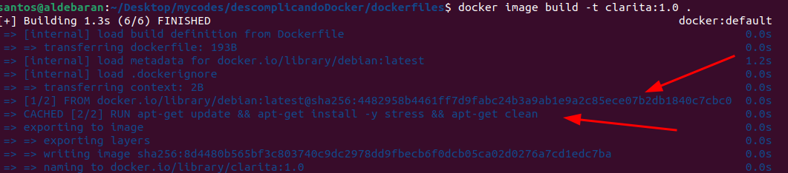

# Criando imagens docker

O `FROM` é destinado a base da imagem. Labels são metadados. Run é para rodar comandos. CMD é para rodar o comando principal. E é possível ver no passo 1 a imagem do debian sendo baixada e no passo 2, havendo o run ocorrendo com o update!

Para criar uma imagem, é necessário criar um arquivo chamado Dockerfile. E para buildar, você precisa o comando build passando o diretório onde está o Dockerfile.

```sh
docker image build -t <nomeimagem>:1.0 ./dockerfiles
```

Nesse caso você está criando uma imagem com nome 'nomeimagem' e a tag 1.0. O ponto no final é para dizer que o Dockerfile está no diretório atual. 
Você pode assistir agora ele resolver o from, realizar o run, e portanto, inscrever a imagem com a tag que foi atribuida.

Só pode ser um CMD por dockerfile! 

No documento do [dockerfile](./dockerfiles/Dockerfile), existem alguns passos posíveis de ver durante o build. 


